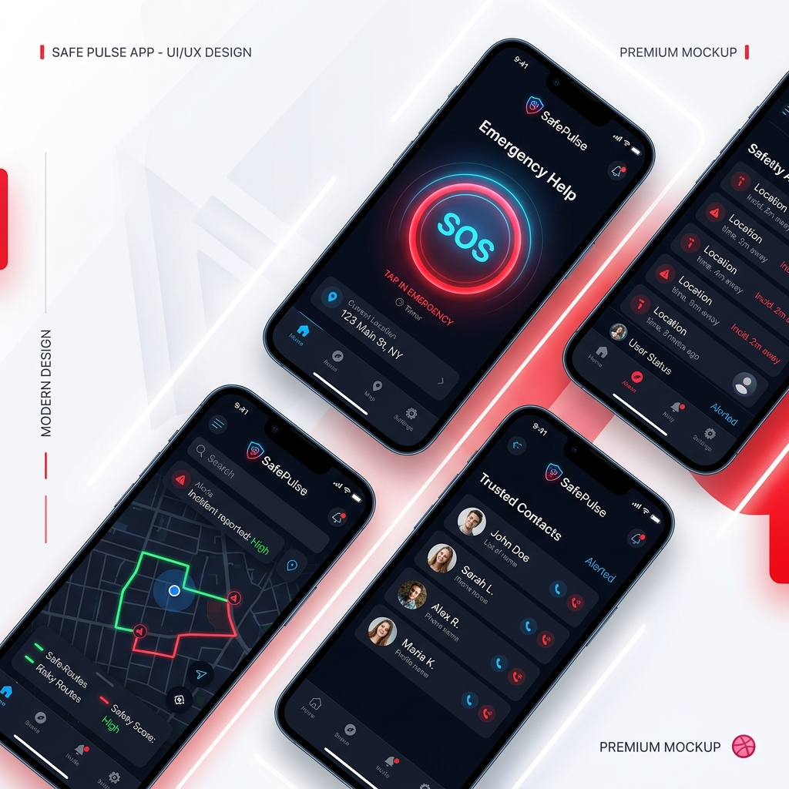
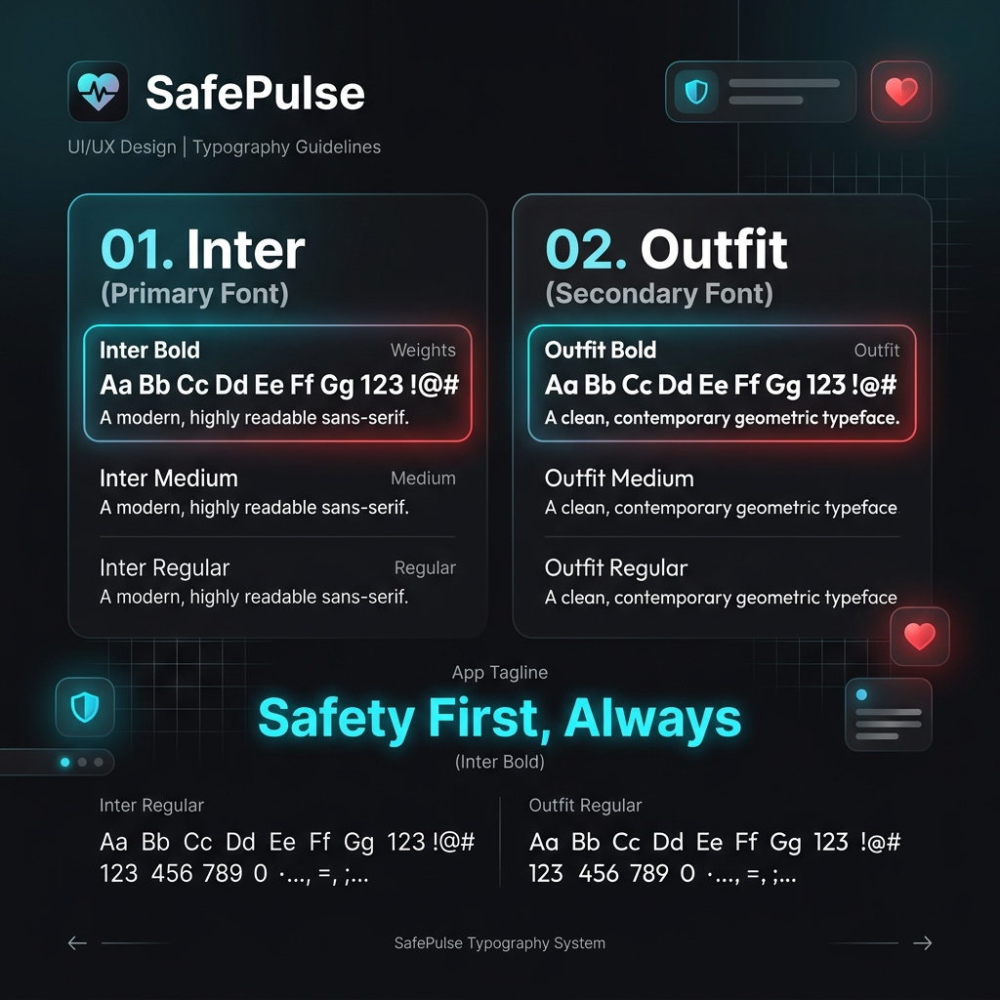
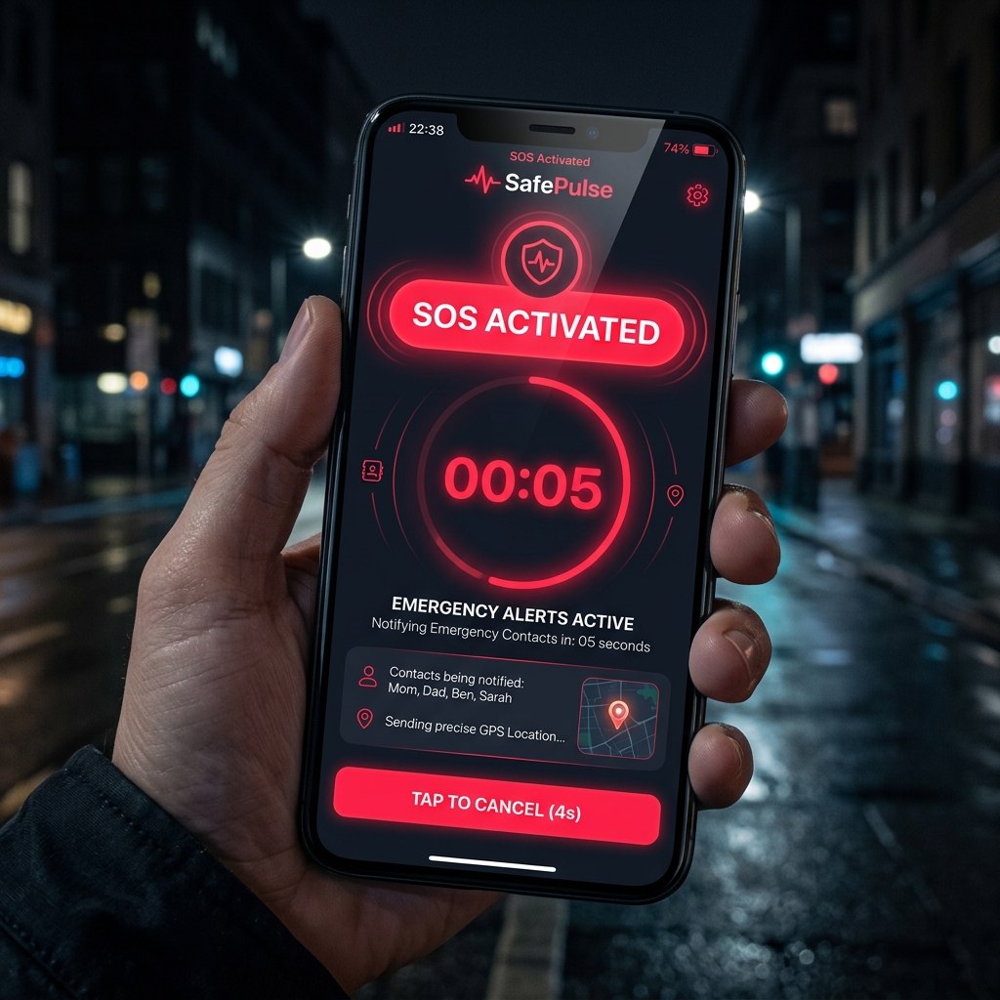
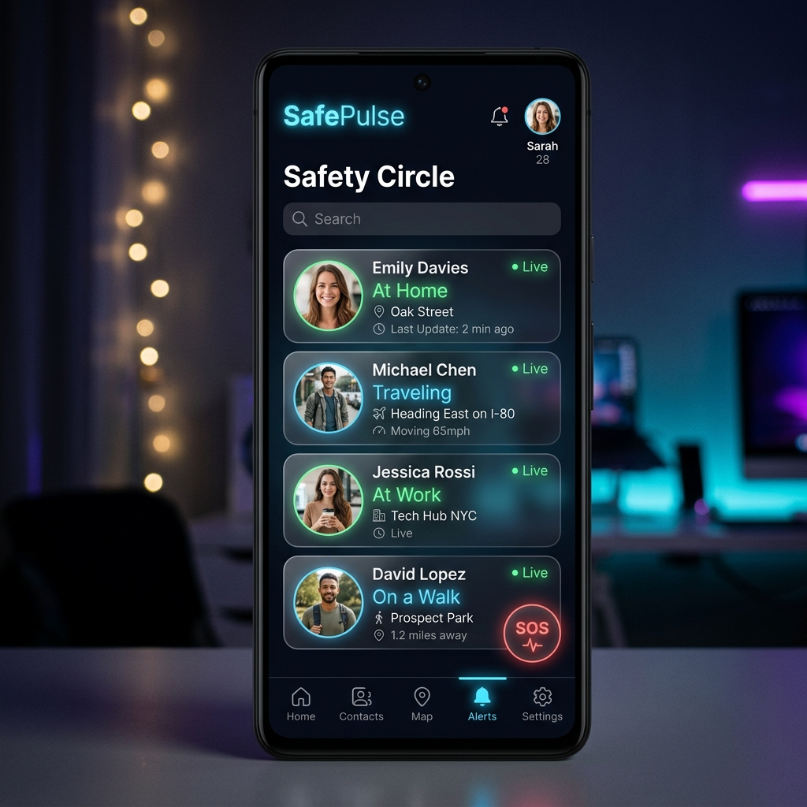

<div align="center">
  
  
  
  <br/>
  
  <h1>🛡️ SafePulse</h1>
  <p><i>The Next-Generation, AI-Powered Travel Safety & Emergency Response Platform.</i></p>

  <p>
    <a href="#-core-functionalities">Functionalities</a> •
    <a href="#-codebase-deep-dive">Codebase</a> •
    <a href="#-offline--background-resilience">Resilience</a> •
    <a href="#-local-development--setup">Setup</a>
  </p>
</div>

---

## 🌟 Overview

**SafePulse** is a comprehensive personal safety ecosystem designed to proactively monitor user journeys, analyze routes for potential risks, automatically detect vehicular crashes using on-device AI, and seamlessly coordinate emergency responses—even in zero-connectivity environments. 

It is built as a highly scalable microservices architecture encompassing a mobile application, real-time API gateway, specialized AI analysis service, and an enterprise-grade event persistence layer.

---

## 🔥 Core Functionalities

### 1. 🧠 AI-Powered Crash Detection
SafePulse continuously monitors device sensors (Accelerometer & Gyroscope). This data is windowed and processed to detect high-impact anomalies that signify a vehicular crash. It utilizes a Python-based microservice running ML models (TensorFlow Lite) and deterministic fallback algorithms for rapid evaluation.

### 2. 🗺️ Smart Risk-Scoring Routing
Unlike standard navigation apps, SafePulse calculates the *safest* route, not just the fastest. 
- It integrates with **OSRM (Open Source Routing Machine)** for generating paths.
- It overlays routing data with our **Crime Zone Database** (persisted in MongoDB) to calculate real-time Risk Scores based on historical incident density, heinous crime records, and past accident zones.

### 3. 🚨 Hybrid Online/Offline SOS Protocol
If a crash is detected or the user manually triggers an SOS, SafePulse initiates a **Hybrid Protocol**:
- **Online Execution:** Fires a high-priority alert to the Spring Boot emergency microservice and broadcasts to trusted contacts via WebSockets.
- **Offline Execution:** Completely bypasses OS restrictions by utilizing a custom Telephony implementation (`telephony_fix`) to dispatch discrete SMS messages (with current or last-known GPS coordinates) and initiate a direct phone call to assigned emergency contacts, regardless of network availability.

### 4. 👥 Safety Circles & Real-Time Tracking
Users can create closed-group "Safety Circles". Circle members receive live WebSocket streams of the user's location, speed, and real-time status. If a user strays from a safe route or exceeds speed limits, the backend flags the journey and alerts circle members.

### 5. 🔐 Secure OTP/JWT Authentication
End-to-end secure authentication utilizing Twilio for OTP dispatch, managed tightly through our Node.js gateway with JWT session persistence.

---

## 🎨 Design System & UI Experience

SafePulse isn't just functionally robust; it is crafted with a highly premium, modern, and accessible design system optimized for emergency scenarios where clarity is paramount.

<div align="center">
  
  &nbsp;&nbsp;
  
</div>

### App Previews

<div align="center">
  
  &nbsp;&nbsp;
  
</div>

---

## 🏗️ Codebase Deep-Dive

The SafePulse repository is partitioned into four distinct services, each handling a specialized domain.

| Service | Technology Stack | Primary Responsibilities |
| :--- | :--- | :--- |
| **Frontend** | Flutter, Dart | Mobile UI, Background Isolate execution, Location Tracking, Telephony integration. |
| **API Gateway** | Node.js, Express, MongoDB | Auth Gateway, Route Scoring Engine, WebSocket Hub, Crime Data management. |
| **Event Persistence** | Spring Boot, Java, JPA/H2 | Immutable recording and resolution tracking of triggered Emergency Events. |
| **AI Analyzer** | Python, FastAPI, TensorFlow | High-speed inference and processing of time-series sensor data for crash detection. |

### 📱 1. Frontend (`/frontend`)
The mobile application built with Flutter.
- **`lib/features/`**: Contains modularized domains like `auth`, `safepulse` (SOS logic), and `tracking`.
- **`lib/core/`**: Houses global configurations, background isolate entry points, and API service wrappers.
- **`packages/telephony_fix/`**: A heavily patched, custom native-channel plugin. Standard background telephony fails on modern Android due to background activity limitations. This package delegates SMS and direct calling to a persistent UI-isolate proxy to ensure 100% reliable offline SOS triggers even when the app is killed or the phone is locked.

### 🌐 2. API Gateway (`/backend`)
The orchestrator of the SafePulse ecosystem.
- **`routes/` & `services/`**: Exposes REST endpoints for OTP, Circle management, and Route Suggestions.
- **Realtime Hub**: Manages Socket.io connections for live geolocation streaming.
- **Crime Data Integrator**: Connects to MongoDB, ingesting CSV-based FIR records to generate spatial risk polygons for the routing engine.

### 🛡️ 3. Emergency Service (`/backend-springboot`)
An enterprise-grade event logger ensuring no SOS trigger is ever lost.
- Built on Spring Boot with Spring Data JPA.
- Provides immutable audit trails of SOS events, including timestamp, location, and resolution status (Active vs. Resolved).

### 🤖 4. AI Service (`/ai-service`)
The mathematical brain of the operation.
- **`app/main.py`**: A fast, asynchronous FastAPI server.
- **`app/services/crash_analyzer.py`**: Analyzes 3D vector magnitude spikes against learned thresholds to prevent false positives while guaranteeing true-positive detection of physical impacts.

---

## ⚡ Offline & Background Resilience

SafePulse is built for worst-case scenarios. 
> [!IMPORTANT]
> A safety app is useless if it dies when you lock your screen. SafePulse maintains a persistent Foreground Service with WakeLocks on Android. The Background Isolate continually processes location and sensor data. If a crash is detected while the phone is locked in your pocket and out of internet range, the system will autonomously execute the `telephony_fix` pipeline to dispatch SMS coordinates and dial your emergency contacts.

---

## ⚠️ Important Note For Cloners

**If you are cloning this repository to run it yourself or build upon it, you MUST replace several placeholders and confidential data points with your own.** We have removed sensitive keys and hardcoded data to protect privacy.

Please perform the following replacements before building:

1. **Google Maps API Key:** 
   - Open `frontend/android/app/src/main/AndroidManifest.xml`
   - Replace `YOUR_API_KEY_HERE` with your actual Google Maps API Key.
   
2. **Local Environment IP:**
   - Open `frontend/lib/core/config/app_config.dart`
   - Replace `http://YOUR_LOCAL_IP:5002` with the local IP address of your backend server for testing on physical devices.

3. **Emergency SOS Numbers:**
   - Open `frontend/lib/features/safepulse/services/sos_service.dart`
   - Replace the default placeholders (`+YOUR_COUNTRY_CODE_YOUR_NUMBER_1`) in the `emergencyContacts` list with your real testing phone numbers.

4. **Environment Variables:**
   - In the `backend` folder, duplicate `.env.example` as `.env` and fill in your actual credentials (MongoDB URI, JWT secret, Twilio credentials).

---

## 💻 Local Development & Setup

### 1. Node.js Gateway
```bash
cd backend
npm install
# Ensure your MongoDB instance is running locally or provide a URI in .env
npm start
```

### 2. Spring Boot Event Service
```bash
cd backend-springboot
# Runs on port 8080 by default utilizing an in-memory H2 database
.\mvnw.cmd spring-boot:run
```

### 3. Python AI Analyzer
```bash
cd ai-service
python -m venv .venv
.venv\Scripts\activate   # Windows
# source .venv/bin/activate # Mac/Linux
pip install -r requirements.txt
uvicorn app.main:app --reload --port 7000
```
*(Run unit tests using: `PYTHONPATH='P:\SafePulse\ai-service' python -m unittest discover -s tests`)*

### 4. Flutter Application
```bash
cd frontend
flutter pub get
# Inject your local backend IP at build time
flutter run --dart-define=BASE_URL=http://<YOUR_LOCAL_IP>:5000
```

---
<div align="center">
  <i>Stay Safe, Stay Connected.</i><br/>
  <b>Built for resilience. Built for life.</b>
</div>
